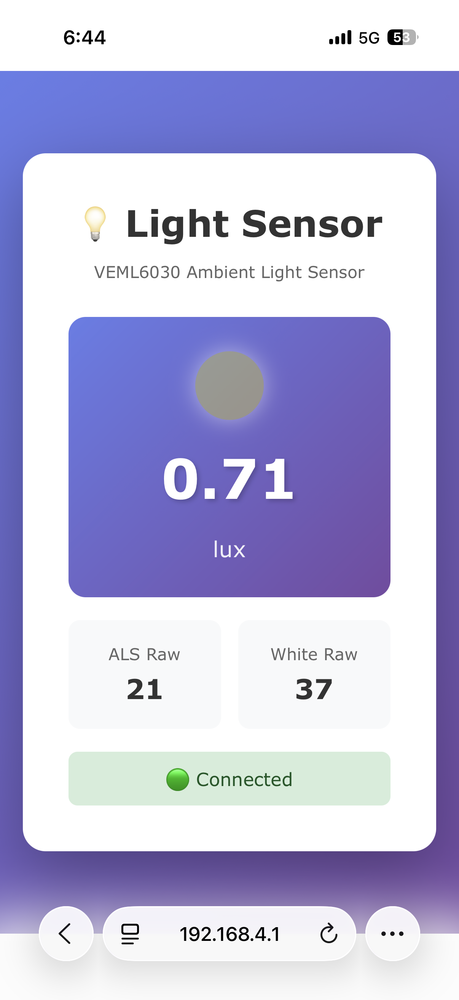

#  ESP32-VEML6030 Light Sensor Web Server

A lightweight embedded web server that displays **real-time ambient light (lux) data** from the **VEML6030** sensor using **ESP32 S3 in **Wi-Fi Access Point (AP) mode**.

This project is ideal for **IoT dashboards, smart lighting systems, and sensor monitoring applications**.

---

## 🚀 Features

- 📡 ESP32-S3 runs as **Wi-Fi Access Point**
- 🌞 **VEML6030 Ambient Light Sensor** (I2C)
- 📊 Live **Lux value monitoring**
- 🔄 Auto-refreshing web UI
- 📁 JSON API endpoint for sensor data
- 🖥️ Simple, responsive web interface
- ⚡ Low-power and fast sensor polling

---

## 🧰 Hardware Requirements

- ESP32 **or** ESP8266
- VEML6030 Ambient Light Sensor
- I2C connections:
  - **SDA**
  - **SCL**
- USB cable & power source

---

## 🔌 Wiring (Typical)

| VEML6030 | ESP32 / ESP8266 |
|--------|----------------|
| VCC    | 3.3V           |
| GND    | GND            |
| SDA    | SDA            |
| SCL    | SCL            |

> ⚠️ Use **3.3V only**. Do **not** connect to 5V.

---

## 📡 Wi-Fi Configuration

- **Mode:** Access Point (AP)
- **SSID:** `ESP_Light_Server`
- **Password:** `12345678`
- **Web URL:**

- 
---

## 🌐 Web Interface

The web dashboard displays:
- Ambient Light (Lux)
- Raw ALS value
- White channel value

The page automatically refreshes to show real-time sensor data.

### 📸 Screenshots

Screenshots of the web interface are included in the repository:

<p align="center">
  
</p>

---

## 🔁 REST API

### Get Sensor Data (JSON)

GET /data


### Example Response
```json
{
  "lux": 215.43,
  "als": 1245,
  "white": 987
}

🛠️ Software Setup

Install Arduino IDE

Install ESP32 / ESP8266 board support

Install required libraries:

Wire

Adafruit VEML6030

Connect ESP board via USB

Upload the firmware

Connect to ESP Wi-Fi network

Open browser and visit:

http://192.168.4.1


